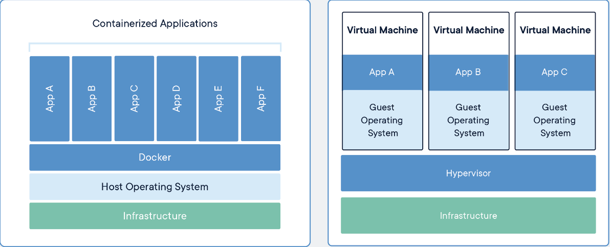
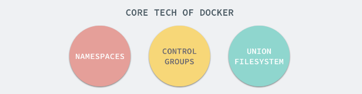
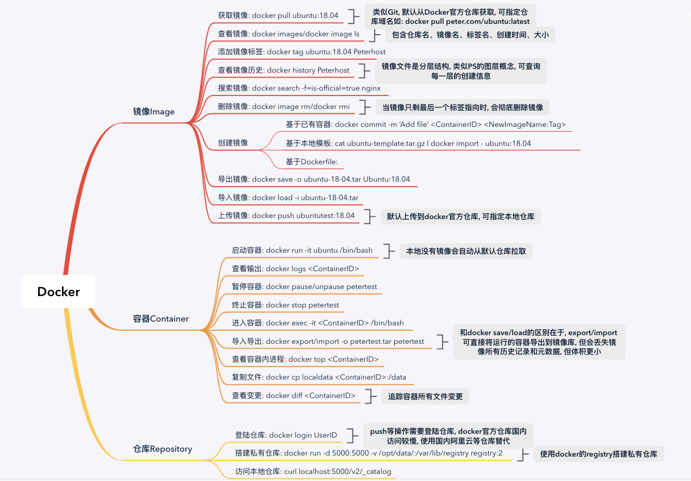

# Docker入门笔记

## 一、Docker简介

### 1. Docker是什么？

​	Docker是基于Go语言实现的开源容器项目，属于C/S架构设计，核心理念是：

> Build, Ship and Run Any App, Anywhere

### 2. Docker解决了什么问题？

​	通过对应用的封装( Packaging)、分发( Distribution)、部署( Deployment)、运行( Runtime)生命周期进行管
理，达到应用组件级别的“ 一次封装 ，到处运行” 。 这里的应用组件， 既可以 是一个 Web 应用、一个编译环境，也可以是一套数据库平台服务，甚至是一个操作系统或集群。

### 3. Docker有什么优点？

- **更快速的交付和部署**

使用Docker可以确保开发、测试、生产等环境的一致性，可实现快速迭代开发部署，环境为产品服务。

- **更高效的资源利用**

相比传统的虚拟化方式，Docker是内核级的虚拟化，不需要VM操作系统层，几乎没有性能损耗。

- **更简单的运维和管理**

全程围绕镜像、容器、仓库设计，配置灵活，更有K8S等容器编排工具，实现高效运维管理不是问题。

### 4. Docker怎么实现的？

Docker的实现依赖于三个Linux底层组件功能：`Namespaces`、`C-Groups`、`Union-Filesystem`

- 命名空间`Namespaces`起到了对文件、进程等资源在操作系统层面隔离的作用。
- 控制组`Control-Groups`则起到了对宿主机物理资源如CPU、内存等隔离的作用，即每个容器可使用的物理计算资源是可控的，否则会出现容器耗尽宿主机资源的情况。
- 分层文件系统`UnionFS`解决了Docker镜像分发的问题，保证APP在开发、测试、生产等环境等一致性。

# 二、Docker核心概念

Docker 大部分的操作都围绕着它的三大核心概念 : 镜像、容器和仓库。因此，准确把握这三大核心概念对于掌握 Docker技术尤为重要。

### 1. 镜像

Docker镜像使用分层文件系统，镜像类似一个真实操作系统的ISO文件，用户可在原始镜像的基础上进行定制化，类似Photoshop里的图层概念。

### 2. 容器

将镜像启动就得到了一个容器实例，容器类似一个轻量级的沙箱，对于宿主机来说就是一个进程，用的还是宿主机的内核，只不过通过上面提到的技术手段将资源隔离了，Docker的设计哲学是一个容器只干一件事，尽可能保持容器的单纯性。

### 3. 仓库

仓库类似于Git代码仓库，用于对镜像的管理，Docker公司维护了一个官方的仓库，任何人可从里面克隆镜像到本地，修改定制后上传到仓库分享到互联网，类似于Github，当然官方也提供了仓库的Docker镜像，任何人都可以克隆该镜像然后在本地创建一个本地私有仓库。

涉及到的相关命令如下：

# 三、Docker安装使用

### 1. 如何安装Docker？

### 2. 使用Docker镜像

### 3. 操作Docker容器

### 4. 访问Docker仓库

# 

# 四、Docker数据管理

# 五、Docker网络

# 六、Dockerfile介绍

# 七、Docker实战案例

# 八、Docker总结于思考

# 九、参考资源

